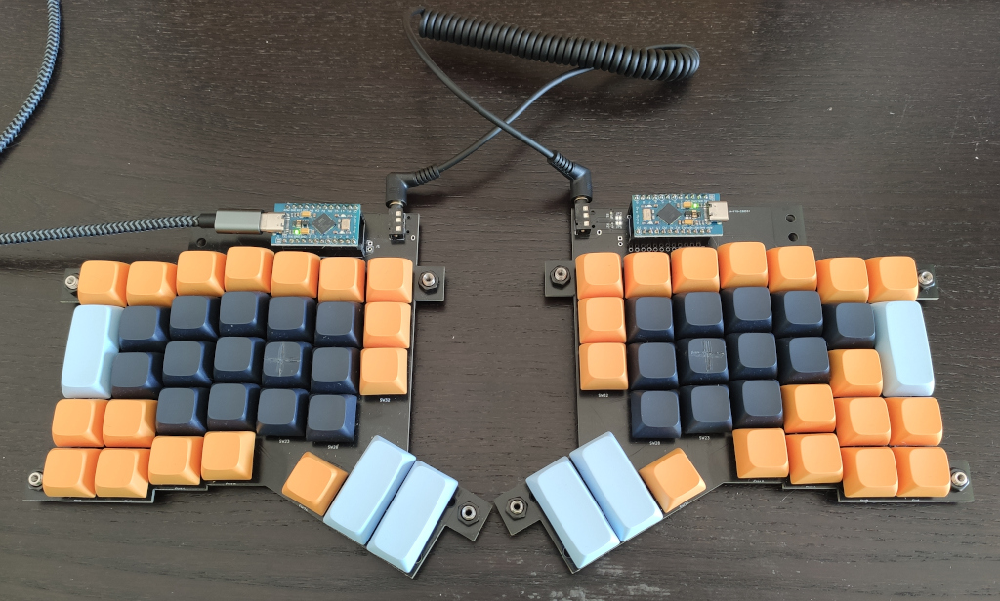
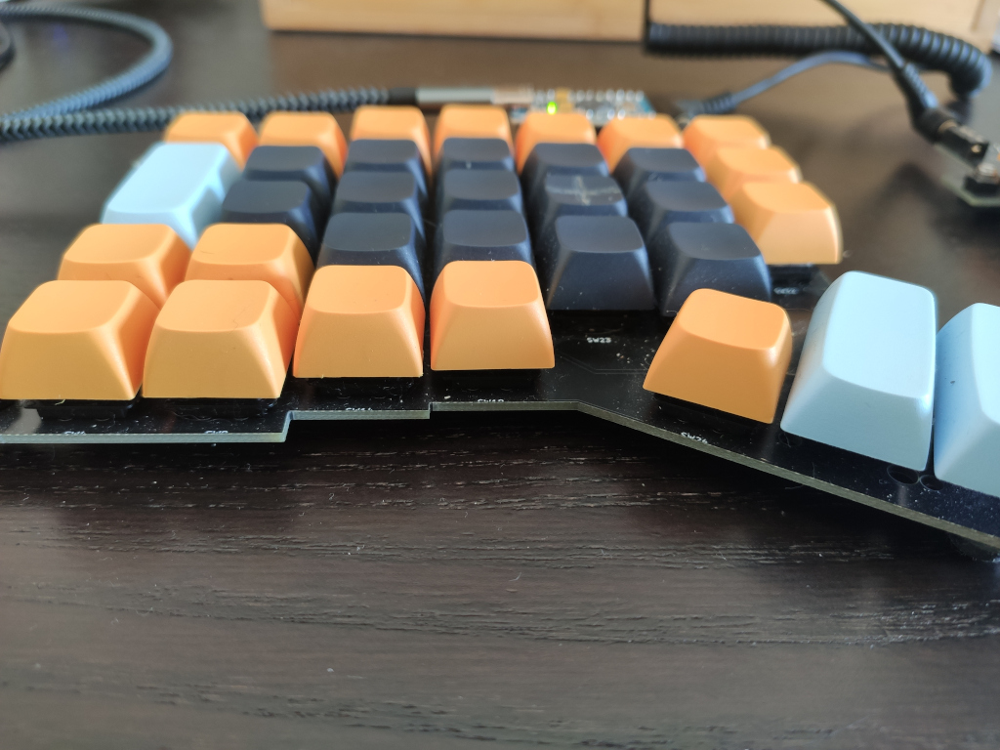

# What's this?

I've worked the ErgoDash keyboard for a while and it felt quite good, but it was a bit too
high for me. So I decided to design my own version in order to make it thinner.
Here's what I did:

- have all switches PCB mounted.
- do not use acrylic frame and let the PCB sit directly on the desktop.
- use low profile Gateron switches (KS-27).

In addition:

- I also added some holes at the corners of the board in order to make it
tiltable/adjustable with some screw.
- I replaced some of the pinky keys with 2u keycaps because my pinky's accuracy
is not really great.

## Kicad preview

## Picture of the assembled board

# What's next?

I've been using this keyboard for more than a year now and I find it really
comfortable. There are still some improvements I would like to try though:

- make a new version with Kailh choch v1 keys in order to see if I can make
it even thinner than this.
- improve keys' position and perhaps also reduce the overall number:
    - central keys are not easily reachable with the index finger, so they
      might be lowered a bit in the layout.
    - 4 keys in the low-left row are too much (I currently have 2 Win-keys +
      Ctrl + Alt), so they can be reduced.
