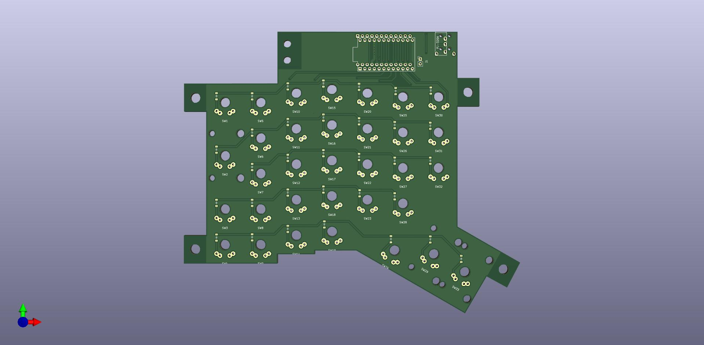

# What's this?

This is (another) split keyboard project which starts from the ErgoDash which I'm currently using and tries to adapt it to my preferences.
Some goals are:

- make it smaller by having all switches PCB mounted
- do not use acrylic frame and let the PCB sit directly on the desktop
- use low profile Gateron switches
- add some holes at the corners of the board in order to make it tiltable/adjustable with some screw

Note = the work is still ongoing and the README will be updated as soon as there are news to share
